# Folksy Stitchers

**[Folksy Stitchers](https://shirral.github.io/folksy-stichers/index.html)** is a website created for a fictional embroidery club meeting up regularly to practice their craft, learn new techniques, make friends, and have a great time while creating something beautiful together with others in a relaxed, informal atmosphere.

The website caters both to existing members, who might wish to join the club's Facebook group or share their ideas for the upcoming meetings, and to new members, who might want to know what meetings are available, where or when they take place, or who might have questions. It also responds to the needs of the uncertain who might wonder whether they want to give it a try, but have some concerns - such as, "I've never done it before, I don't know where to start", or, "do I need to bring anything?".

## Features

### General

- **responsive design**: the website responds to a wide variety of screen sizes. Individual elements of each page have been given their own media queries featuring breakpoints adjusted as needed for the element to look good on a particular screen instead of picking a few set breakpoints and ignoring the screens in between which might need additional adjustments. 
  
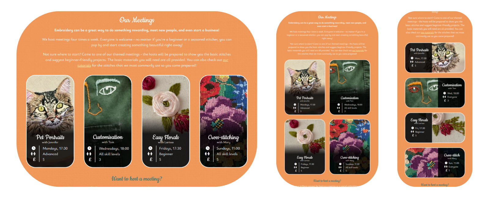

### Navigation bar

The navigation bar was built using Bootstrap and customized with CSS. It allows the user to easily move between the website's three pages: the home page, the "Our Stitches" page with information and tutorial videos on the most common embroidery stitches used during the club meetings, and the "Contact" page where the contact information and the newsletter signup form can be found.

On mobile devices (breakpoint at 767px), the navbar collapses into a burger icon that can be expanded upon tapping.
  

To improve the semantic structure of the navigation bar, the `<menu>` tag has been used instead of the more generic and non-specific `<ul>`.

### Hero image section

The hero image section is present on all the pages, as a strong visual element that lets the user know what the page is about and invites them to continue reading and as a familiar, repeating element of the interface that ties the design of the website together. 

It features an image relevant to each page's topic with a gradient overlay that provides darker background for the text, big text stating the page's topic with a subtle animation, and a gently pulsing Font Awesome down arrow icon that scrolls down, taking the user to the main body of the page, upon clicking.
  

### "Welcome" section

The "Welcome" section introduces the user to Folksy Stitches - what it is, what is the purpose of the club, and what they might expect upon joining. 

It features a heading, a short paragraph of text that conveys the main goals of the club and its atmosphere and a Flickity carousel gallery showcasing the photographs of the club meetings: the club members at work and the embroidery created during the meetings.
  

### "Our Meetings" section

"Our Meetings" section aims to provide the basic information about the club meetings: what meetings are avaiable, how often they happen and on what days, what is the time of the meetings, their cost, and what skill levels they cater to.

A heading and three short paragraphs of text are followed by a grid showcasing the information about four kinds meetings. Each grid item contains a picture representing the meeting's theme, its name, the name of the person hosting the meeting, and the information about the date, time, skill level and cost. There is a black semi-transparent overlay on top of the images to provide good contrast between the picture and the the white text on top of it, making it easy to read.

Below the grid, there is a **Want to host a meeting?** subsection. The text invites the user to share their ideas for a meeting they might like to host; below, a link styled as a button invites them to click on it, leading them to the Contact page where the club's contact information can be found. The link-button changes its colours upon hovering over it with a mouse.
  

### "Stitches we use" section

This section is aimed at embroidery beginners. It's a resource allowing the user to get familiar with the most common stitches routinely used at the club meetings, learn what a given stitch can be used for, and how to sew it.

The section as it appears before the user when they visit the Our Stitches page contains a heading, two short paragraphs of text and a grid of eight interactive elements. Each element contains the name of the stitch it presents, a dark gradient below it to make the text visible and keep the visual style of the information boxes consistent across the pages, and picture presenting the stitch used in embroidery below the text and the gradient.
  

Upon clicking on the chosen box, a modal appears at the centre of the screen. Here the user can learn about the stitch of their choice and watch an instructional video on how to do it.

The videos are all embedded YouTube videos and the modals were created using Bootstrap's modal component. The user can leave the modal either by clicking on the "Close" button, or by clicking away from the modal - on the darkened background around it.
  

### Newsletter signup section

The first section on the Contact page gives the user the opportunity to stay up to date with the club's activities - either by joining the club's Facebook group where an inline link in the first paragraph leads, or by signing up to the club's newsetter.

The second paragraph of text invites the user to sign up, explains the benefits of doing so, and tells the user how often the newsletter would be sent. It is followed by a **signup form**.

**The newsletter signup form** asks the user to provide their name and email address (a text field and an email field), asks about their embroidery proficiency level (radio inputs), and about their main reasons for doing embroidery (multiple choice question - checkbox inputs). The answers to the two questions mentioned would be used by the club to curate the right kind of content for every newsletter recipient - for example, they would send complicated project ideas only to the most experienced members, while the members who run their own embroidery businesses could receive tips on marketing their creations to a wider audience.
  

At the very end of the form is a "Sign up!" button. The button changes its colours upon hovering over it with a mouse. After clicking it, the user is redirected to a *Thank you* page which confirms their signup was successful. From there, they can click on the "BACK TO THE SITE" button, taking them back to the Contact page, or use the navigation bar to go to the page of their choosing.
  

### "Contact us" section

This section exists to provide the user with a means of contacting the club. It consists of a heading, a paragraph of text, and the club's email address with a Font Awesome icon and a link, allowing the user to click on the address to open their email client, if they have one, and start writing their message that will be sent to the club's email address.
  

### "Where to find us" section

This section provides the user with the physical address of the place where the club meetings take place. As with the email address in the previous section, the address is separated from the paragraph of text by margins, higher font weight, and the inclusion of a Font Awesome icon.

The section also contains an embedded Google Maps map centered on the location of the club activities with a pin highlighting the right place and the address visible in the upper left corner.
  

### Footer

The simple footer adheres to the website's colour scheme and features three external links to the club's social media pages - Facebook, YouTube, and Instagram - in form of Font Awesome social media icons. There is also a short paragraph of text below the links.

The footer is present at the very bottom of each page of the website.
  

### Future features

- **additional page with downloadable embroidery patterns:** free patterns divided by the techniques used and their difficulty level would make a great asset for the club members.

- **additional page with stories from members:** Folksy Stitchers is meant to be a social club - it would be good if the website could reflect that more. Personal stories from the members about their club adventures, the friendships the club helped them make, and the other benefits they draw from being a part of the organisation, would be great - they could be important for the potential new members trying to figure out whether they want to try it or not.

- **"back to top" sticky button**: it might improve the user experience on mobile devices, where there's a bit of scrolling to do.

- **rounded corners on the carousel gallery:** it would be great to match the carousel to fit visually with the other rectangular elements of the website, which have all been given rounded corners. Sadly, I was not able to achieve that in case of the Flickity carousel. Future releases would benefit from its own custom-made carousel which would be easier to customize; it would also lower the site's dependency on external assets.

- **rotating animation on the "Our Meetings" section grid items on hover:** it would add an engaging and visually pleasing way of providing additional information about the meetings to the desktop users. Upon hovering over a meeting of their choice, the grid item 'card' would rotate/flip, revealing additional information about the meeting.

- **zoom-in/expand animation on the "Our Stitches" section grid items on hover, with a dropped shadow:** making the grid items pop out upon hovering over them with a mouse would invite the user to click on them and let them know there is additional information to be found there.

- **more fluid hover animations:** buttons and links that change their state on hover would look better if the change of state was more gradual. It would be good to add simple CSS animations to achieve that.

- **better optimization:** although the website looks good and works well on all screen sizes, it could be optimized better to use up less data and load faster, especially on mobile devices. Differently sized image files could be provided for different devices and next-gen image formats could be used. Bootstrap could be removed and its components used in the project could be replaced with custom-made ones to avoid the user's browser having to load a big external asset.

- **better accessibility:** using Font Awesome means some elements of the current design might not be clear to screen reader users, as they cannot have `aria-label` attribute added to them. Future releases would benefit from their own icons presented as image files.

- **replacing the club's name with a logo in the navbar:** creating a custom logo for the club would give it a more unique, independent character. It would also make the fictional club seem more real.

## User Experience & User Interface (UX/UI)

### Site goals

The main goal of the **Folky Stitchers** website is to provide its users - club members and potential future club members - basic information about the club and the meetings it hosts. It also aims to encourage embroidery beginners who might be worried about their lack of experience by providing reassuring words and the information about the basic stitches they will need to start, along with simple to follow tutorials.

The website also invites the users to follow the club's activities more actively by encouraging them to join their Facebook group, sign up to their newsletter, and visit their social media profiles. Finally, it gives the users a way of contacting the club.

The users should be able to find their way around the website easily while the design should be pleasing to the eye and work on a wide variety of devices without causing unpleasant visual glitches or functional errors. 

### User stories

#### First time visitors - ie. curious about the club:

- As a First Time Visitor, I want to learn what the club is about.
- As a First Time Visitor, I want to learn what kind of activities the club offers.
- As a First Time Visitor, I want to learn if I can join without any prior embroidery experience.
- As a First Time Visitor, I want to learn what is the character of the club - is it for people serious about learning and perfecting the craft? Or more laid back with a bigger focus on the social aspect?
- As a First Time Visitor, I want to find the club's social media pages to look up what kind of things they post there.

#### Returning visitors - ie. considering joining the club:

- As a Returning Visitor, I want to ask someone questions about the club.
- As a Returning Visitor, I want to learn how much do the meetings cost.
- As a Returning Visitor, I want to learn if I'd need to bring anything to a meeting if I was to come.
- As a Returning Visitor, I want to learn if I can prepare a little bit before coming to my first meeting - I don't want the host to have to focus on teaching me the most basic things while the rest of the group waits.
- As a Returning Visitor, I want to learn where do the meetings take place.

#### Frequent visitors - ie. existing club members:

- As a Frequent Visitor, I want to find a way to keep in touch with the other members of the club.
- As a Frequent Visitor, I want a to be updated with the latest news and information about the club's activities.
- As a Frequent Visitor, I want to find the club's email address so I can suggest my ideas to the organisers.

### Design

#### Colour scheme

The Folksy Stitchers website features three main colours:

- white `(#ffffff)`
- dark cyan `(#207178)`
- orange `(#F29552)`

and two accent colours, used sporadically where a slight colour variation is needed:

- light cyan `(#4FA3AB)`
- pastel yellow `(#FDF6B1)`

The dark cyan and orange are complimentary colours chosen to go well with one another, and with white - a neutral colour. They are calm and toned down while remaining a friendly, colourful combination - a good representation of the club's character.

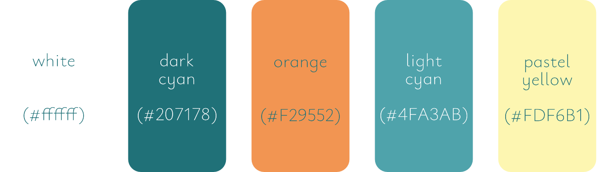

### Typography

The website features two fonts:

- **Cookie** - a cursive font used for the headings
- **Ysabeau Infant** - a sans-serif font used for any other text

Both fonts avoid sharp edges, promoting soft curves and round characters instead. It helps to convey the informal, friendly character of the club.

Both fonts are served by Google Fonts. As the default browser font selection does not have any fonts that would be remotely similar to the ones I chose for the project, no specific fallback fonts have been provided. In the rare event of Google Fonts not being available, the browser is instructed to use their default fonts from its cursive and sans-serif selection. They would all look bad anyway.

### Imagery

The imagery of the website uses pictures that provide the user with the feelings of coziness, friendliness, safety, and fun. The big hero image on top of every page is designed to take up the full screen of the user's browser (up until the screen width of 1920px; above that, a more moderately sized hero image section performs better) to immediately let them know what the site aims to convey and to let them take a moment to feel welcomed before continuing to the main body of the page.

The images, infoboxes, modals and embedded `<iframe>` elements have been given rounded corners for a soft, reassuring look.

### Wireframes

As for this project I did not need to cooperate with other developers, I did not see the need to use digital tools to make "proper" wireframes. I find it much more efficient to sketch out my ideas on paper. While I could had redone them with digital tools later to make them look pretty - and it is something I plan on doing in the future when I need to communicate my ideas to others clearly in the planning stage - in this case, that would had been a waste of time.

Below are the sketches made in the planning stage of working on the project, along with some early notes - please excuse the lined paper, sadly I had no plain paper available at the time.

**Mobile view:**

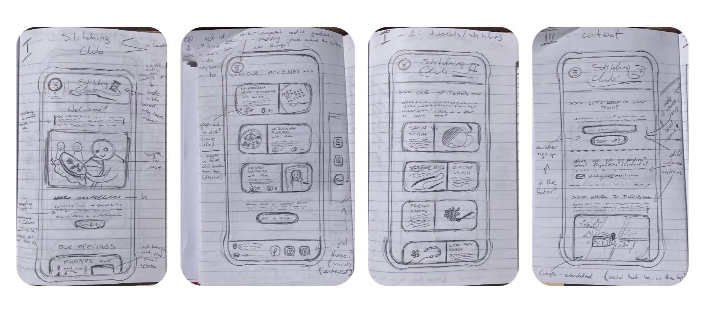

**Desktop view:**

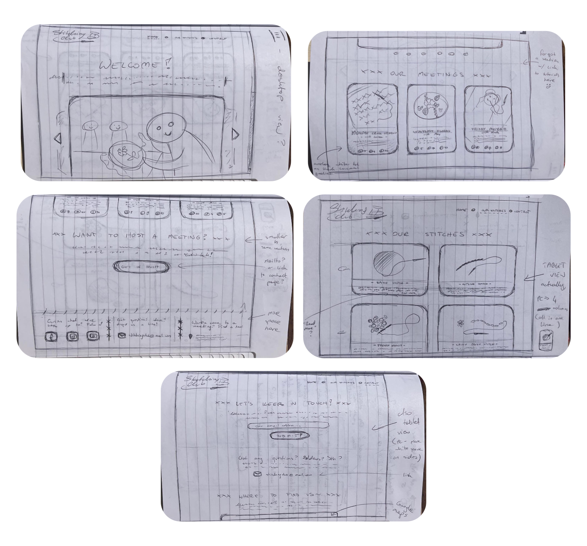

**Other notes:**

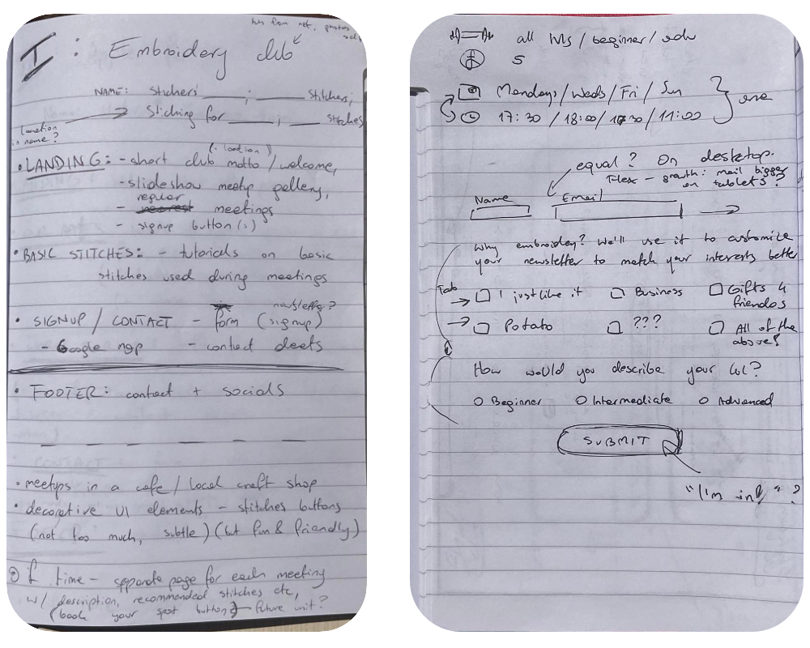

## Testing

### Validator Testing

- **HTML:**
    - the first round of testing revealed a few minor errors (mismatched opening and closing heading tags, unexpected characters) and warnings (mostly about the usage of `aria-label` attributes), which have been fixed. The subsequent testing revealed no errors. [W3C validator](https://validator.w3.org/) was used.

- **CSS:**
    - No errors were found in the custom CSS code. [W3C Jigsaw validator](https://jigsaw.w3.org/css-validator/) was used.

- **Performance, accessibility, best practices and SEO:**

    - The above have been tested with [Lighthouse](https://chrome.google.com/webstore/detail/lighthouse/blipmdconlkpinefehnmjammfjpmpbjk). The Performance is the weakest point of the website, with a score of 73% (the yellow zone). Some steps suggested by Lighthouse have already been taken - such as compressing the images and using lazy loading - but there's still room for improvements.
    The Accesibility, Best Practices and SEO are all in the green zone, with 95%, 100% and 100%, respectively.

### Manual Testing: Features

| Feature       | Expected behaviour | Action  | Result
|---------------|--------------------|---------|----------
| *Responsive design* | When the browser window is resized, the design should change accordingly so the website remains visually pleasing, easy to read and to use. | The browser window is resized to take up different portions of the screen. | The page elements respond to the changes: images, iframes and headings change their size, the text wraps accordingly, the carousel features different navigation elements on different screen sizes, the grids and modals show different layouts, the text wraps accordinly, the navigation menu turns into a burger icon at certain breakpoint. 
| *Navigation bar* | When the links in the navigation bar are clicked, they should lead the user to the right destinations: the logo and *Home* - to `index.html`; *Our Stitches* - to `our-stitches.html`; *Contact* - to `join-us.html`. | Each of the links is clicked on each of the pages. | The links lead where they are expected to lead.
| *Navigation bar: mobile view* | When the collapsed burger icon is tapped, it should expand. When it is tapped again, it should collapse. | The the collapsed burger icon is tapped. The expanded burger icon is tapped. | The burger icon expands and collapses properly.
| *Hero image section* | When each page is loaded, the hero image should show taking up the entire screen (on screens up to 1920px width). It should load with a dark gradient overlay in the bottom part of the image and a white text with a zoom-in animation. Below the text, a down arrow icon with a pulsing animation should be visible. | Each page is loaded and then refreshed. | The hero image section loads, taking up the entire screen. Each background image loads properly. The gradients loads properly. The text loads properly. The text animation runs properly. The icon loads properly and its animation displays properly.
| *Hero image section: down arrow icon link* | When the arrow icon is clicked, it should scroll the page down past the hero image section, to the beginning of its main content. | The arrow icon is clicked on each of the pages. | The site scrolls past the hero image section to the first section of the main body of content of each document.
| *"Welcome" section* | All the information should be displayed in a visually pleasing, clear and easy to read way. It should be possible to navigate between the pictures back and forth using both clicking on the navigation arrows and swiping. It should be possible to go to the picture of one's choice by clicking on the dots below the carousel in desktop view. When clicking on the right arrow icon or swiping left while at the last picture, the slides should go back to the beginning - the first picture should be presented again. | The page is refreshed. Both arrow icons are clicked until all of the images are shown and the first image is presented again. The carousel is swiped in both directions until all of the images are shown and the first image is presented again. All of the dots below the carousel are clicked in desktop view. | The information is displayed in a visually pleasing, clear and easy to read way. The carousel responds to the use of each one of the navigation methods. The images wrap properly - the first image is presented again after the last one.
| *"Our Meetings" section* | All the information should be displayed in a visually pleasing, clear and easy to read way. The links should take the user to the right destinations: the *our tutorials* inline link - to `our-stitches.html`, the *GET IN TOUCH* button-styled link - to `join-us.html`. The *GET IN TOUCH* link should change its background colour on being hovered upon on desktop devices. | The page is refreshed. Both links are clicked. The *GET IN TOUCH* link is hovered upon on a desktop device. | The information is displayed in a visually pleasing, clear and easy to read way. Both links lead where they should. The *GET IN TOUCH* link changes its background colour on being hovered upon.
| *"Stitches we use" section* | All the information should be displayed in a visually pleasing, clear and easy to read way. Each grid element should trigger a modal when clicked. | The page is refreshed. Every grid element is clicked. | The information is displayed in a visually pleasing, clear and easy to read way. Clicking on every grid item results in the appearance of the relevant modal. 
| *"Stitches we use" section: modal* | All the information should be displayed in a visually pleasing, clear and easy to read way. The video and the text should be relevant to the stitch the modal is about, the video should work when run, and should not autoplay. The modal should disappear when the user clicks on the *Close* button or when they click away from the modal. | Every modal is called separately. The video is played, then stopped. The *Close* button is clicked. The darkened space around the modal is clicked. | The information is displayed in a visually pleasing, clear and easy to read way. Each video is relevant to the modal's topic. Each video runs properly and does not autoplay. Clicking on the *Close* button or away from the modal closes it.
| *Newsletter signup section* | All the information should be displayed in a visually pleasing, clear and easy to read way. The inline link to a Facebook group should lead to Facebook and open in a new tab. | The page is refreshed. The link is clicked. | The information is displayed in a visually pleasing, clear and easy to read way. The link opens in a new tab and leads to Facebook.
| *Newsletter signup section: form* | The form should not allow the user to submit it if the *Name* and *Email* fields are not filled. The *Sign up!* button should reverse its colour scheme when hovered upon. The form should take the user to `thank-you.html` upon submitting it by clicking on the button. | Submitting an empty form is attempted. Submitting a form with only the *Name* field filled in is attempted. Submitting a form with only the *Email* field filled in is attempted. Submitting a valid form is attempted. The *Sign up!* button is hovered upon. | The form only allowed the user to submit the information if both the *Name* field and the *Email* field were filled in. The *Sign up!* button reversed its colour scheme when hovered upon. When clicked, the form was submitted and the `thank-you.html` page was loaded.
|  *Newsletter signup section: thank you page* | All the information should be displayed in a visually pleasing, clear and easy to read way. The *BACK TO THE SITE* link-button should reverse its colour scheme when hovered upon. When clicked, it should take the user back to `join-us.html`. | The page is loaded. The link-button is hovered upon. Then, it is clicked. | The information is displayed in a visually pleasing, clear and easy to read way. The link-button reversed its colour scheme when hovered upon. When clicked, it directed the user to `join-us.html`.
| *"Contact us" section* | All the information should be displayed in a visually pleasing, clear and easy to read way. The email link should prompt the user's defaut email client to open and start an email adressed to "hello@folksystitchers.com" when clicked on. | The page is refreshed. The email address is clicked. | The information is displayed in a visually pleasing, clear and easy to read way. Clicking on the email address runs the user's default email client (if they have one) and starts a new email addressed to the right address.
| *"Where to find us" section* | All the information should be displayed in a visually pleasing, clear and easy to read way. The embedded map should load and show the address location in the centre. | The page is refreshed. | The information is displayed in a visually pleasing, clear and easy to read way. The map loads and shows the location correctly.
| *Footer* | The footer's three icons and the text below them should be displayed in the centre of the footer. Each icon should lead to an external site it represents - Facebook, YouTube, and Instagram - when it is clicked. Each page should open in a new tab. | The page is refreshed. Each icon is clicked on. | The footer displays correctly. Each icon leads to the right site, which opens in a separate tab.

### Manual Testing: Testing User Stories from the UX/UI section

**1. First Time Visitor Goals**

- *As a First Time Visitor, I want to learn what the club is about.*
    - Upon visiting the home page, a big hero image showcasing an embroidery with a big text saying "Welcome to Our Embroidery Club!" is shown. Chances are it's about embroidery.
    - If the user scrolls down or clicks on the down arrow icon, they are taken to the "Welcome" section which explains what the club is all about. The picture gallery showcases photos taken during the club meetings, and the "Our meetings" section right below praises the benefits of embroidering, describes how the club meetings work and shows the ones available, and invites the newcomer to join in. 

- *As a First Time Visitor, I want to learn what kind of activities the club offers.*

    - Reading the "Welcome" section and looking at the pictures there lets the user know the club is a social space where people come together to enjoy embroidery as a group.
    - Scrolling down, the user reaches the "Our meetings" section, where the the club's regular meetings are listed along with the information about their theme, suitability for people with different amount of experience in embroidery, their cost, date, time, and who the host is.

- *As a First Time Visitor, I want to learn if I can join without any prior embroidery experience.*

    - Scrolling the home page, the user quickly reaches "Our Meetings" section. There, they see the text stating that everybody's welcome to come, and that even the beginners can start creating beautiful things right away. There's also a reassuring message stating that the hosts will be prepared to teach them what they need to get started and will be able to sugest projects suitable for beginners, and a link to a page where they can learn some basics even before coming to the meeting if they wanted to. 

- *As a First Time Visitor, I want to learn what is the character of the club - is it for people serious about learning and perfecting the craft? Or more laid back with a bigger focus on the social aspect?*

    - The user visits the home page and sees the name of the club: *Folksy Stitchers*. It might have something to do with the character of the club.
    - The user scrolls down to the "Welcome" section. It clearly states that the club promotes the laid-back, friendly atmosphere.
    - The user scrolls down to the "Our Meetings" section. They see that there aren't fixed closed groups; there is a variety of themed meetings with suggested skill levels, but at the same time, there is information that the hosts are able to acommodate people of any amount of experience and that the beginners are very welcome. There is no signing up, booking spots or paying in advance, anyone can just turn up on the day and join - it's an informal, welcoming space.

- *As a First Time Visitor, I want to find the club's social media pages to look up what kind of things they post there.*

    - If the user is accustommed to the modern practices, they will either start their search at the very top, or the very bottom of the page. The later will get them to the footer where the links to the club's social media pages can be found.
    - If the user doesn't know where the social media links are usually found, they will most likely scroll the home page until they reach the bottom. They will then find the footer where the links to the club's social media pages can be found.

**2. Returning Visitor Goals**

- *As a Returning Visitor, I want to ask someone questions about the club.*

    - The navigation menu sat on the very top of each page features a link to the "Contact" page, where the club's email address can be found.
    - Scrolling the home page reveals the "Want to host a meeting?" subsection. While aimed specifically at people who would like to run a club event themselves, here the user can read that the club can be contacted either my email, or in person. There is a link saying "GET IN TOUCH"; clicking on it will lead the user to the "Contact" page.
    - At the bottom of each page is the footer, featuring the links to the club's social media channels. The club can be messaged there, too.

- *As a Returning Visitor, I want to learn how much do the meetings cost.*

    - The user goes back to the "Our Meetings" section where the club meetings are listed. Without having to click on anything else, they can see the cost of each meeting in its information box.  

- *As a Returning Visitor, I want to learn if I'd need to bring anything to a meeting if I were to come.*
    
    - The user goes back to the "Our Meetings" section where the information about the club meetings is to be found. There, they can read that the basic materials they will need are all provided.

- *As a Returning Visitor, I want to learn if I can prepare a little bit before coming to my first meeting - I don't want the host to have to focus on teaching me the most basic things while the rest of the group waits.*

    - The user might have already explored the club's website on their previous visit. If they have, they will navigate to "Our Stitches" website using the navigation bar on the top of the website. They can learn the basics there.
    - If they haven't explored the website earlier, the user might go back to the "Our Meetings" section where the information about the club meetings is to be found. There, they will find that they can learn the basics on "Our Stitches" page of the club's website. The link in the "Our Meetings" section will lead them there.

- *As a Returning Visitor, I want to learn where do the meetings take place.*

    - As the address information is usually found in the "Contact" area of most websites, the user might navigate there using the navigation menu. They will find the location of the club meetings there, along with the exact address of the place and a map showing it in the neighbouring area.
    - The user might also go back to the "Our Meetings" section where the information about the club meetings is to be found. They will find the location of the meetings there.

**3. Frequent Visitor Goals**

- *As a Frequent Visitor, I want to find a way to keep in touch with the other members of the club.*

    - A Frequent Visitor will most likely know the best place to look for a feature like this would be the "Contact" page. They navigate there using the navigation menu. There, they find a link to the club's Facebook group where the club members can interact with one another.

- *As a Frequent Visitor, I want a to be updated with the latest news and information about the club's activities.*

    - A Frequent Visitor will most likely know the best place to look for a feature like this would be the "Contact" page. They navigate there using the navigation menu. There, they find a newsletter signup form which they have likely seen before. They can fill it to be informed about the latest news and information about the club's activities.

- *As a Frequent Visitor, I want to find the club's email address so I can suggest my ideas to the organisers.*

    - A Frequent Visitor will most likely know the best place to look for a feature like this would be the "Contact" page. They navigate there using the navigation menu. The club's email address can be found there.
    - Alternatively, a Frequent Visitor might remember there was a mention of suggesting one's own ideas somewhere on the club's home page. Scrolling it, they reach the "Want to host a meeting?" subsection and click on the link leading them to the "Contact" page where they find the club's email address.

### Further Testing
The website has been tested on a variety of screen sizes (resizing the browser window on desktop, tablet, smartphones), browsers (Chrome, Safari, Opera, Edge, Brave, Firefox), and devices. Family and friends have been asked to perform additional testing on devices I had no access to (like a MacBook, or non-Apple tablets). The website has performed as expected on all the screen/device/browser combinations, except for the iPad Air (4th generation), which would not display an underline under the currently active page in the navigation bar - no matter the browser (tested with Chrome, Safari, Opera, and Firefox). It would also display a thin white bar underneath the footer on Opera and Firefox. The Android and desktop devices using the same browsers would not have that issue. Other than that, the device would display everything properly. Refer to the "Known Bugs" section below to see the screenshots of the issues.

### Known Bugs

- **Embedded YouTube videos don't stop playback once the modal they're embedded in is closed. The sound can still be heard.** This is a known issue with embedding YouTube videos in Bootstrap modals and it requires additional JS code to be fixed. I have tried several solutions using external JS code snippets I found on the internet, but my current understanding of JavaScript is not yet good enough for me to have been able to use and adapt the code for the needs of my project at this point.

- **On iPad Air (4th generation), no underline is shown under the active item in the navigation menu.** I haven't been able to determine whether the issue is iPad-specific, iPad-Air-specific, iPad-Air-4 specific, or just my device-specific, as I haven't been able to find any other iPad owners to ask them to check it on their devices. It persisted on every browser I tested the website on (Chrome, Safari, Opera, Firefox). The issue does not occur on Android devices nor desktop browsers.
  

- **On iPad Air (4th generation), there is about a white gap between the footer and the bottom on the screen when the page is viewed on Opera and Firefox browsers.** I haven't been able to determine whether the issue is iPad-specific, iPad-Air-specific, iPad-Air-4 specific, or just my device-specific, as I haven't been able to find any other iPad owners to ask them to check it on their devices. The issue does not occur on Chrome and Safari browsers, nor or Opera and Firefox browsers on Android devices and desktop browsers.
  
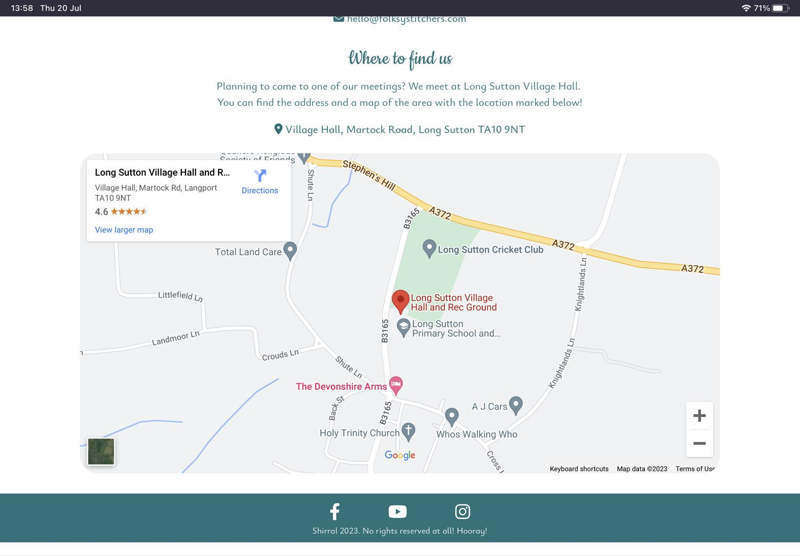

- **Most images are too small for 4K screens and will display with white space on the sides.** It would be good to provide bigger versions of the images for devices with big screens in the future, or at least to change the way the images are displayed on these using `object-fit: cover`.
  
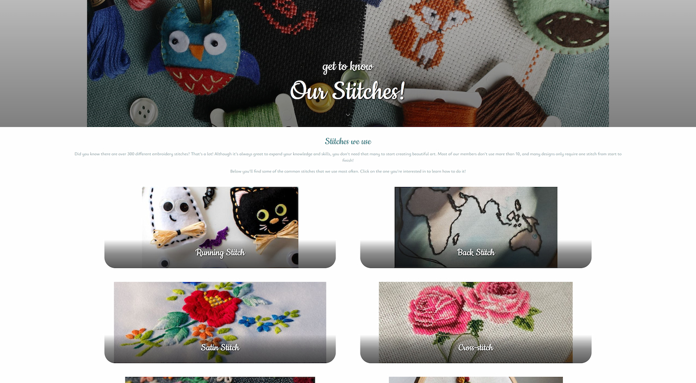

### Bugs fixed & problems overcome

- **Hero image section would present the cover text cut in half in the landscape mode in mobile phones.** 
    - adding new media queries for the section solved the problem.

- **Once the project was deployed to GitHub pages, submitting the form on the Contact page would result in an error 405 page.** 
    - Changing the form attribute `method` from `post` to `get` and sending the user to a "Thank you" page instead of a displaying a browser alert as a confirmation for the user solved the issue. 

- **On mobile devices, the expandable Bootstrap burger menu icon would either not position itself at the very right side of the navigation menu, or it would stay expanded at all times, depending on the approach I took.** 
    - It turned out I was using and overriding obsolete classes from an older version of Bootstrap which would not work as expected with Bootstrap 5. Using the right classes solved the problem.

- **The grid on the "Our Stitches" page was overlapping the footer.**
    - Before I learned what causes the issue, I compensated for it by setting additiona margins and paddings, which was not the most elegant solution. It turned out the culprit was the `gap` property set in `%` units - it can cause overflow when not used carefully. Using `px` units for the `row-gap` instead solved the problem.

- **Several links stopped working after changes were made to the `id`'s they were linking to and I forgot to update the links.** Fortunately, this was caught early on.

- **The logo link did not work.** I forgot to replace the `#` with an actual address of the page after having copied the navbar to other pages. Fortunately, this was caught early on.

- At some point, **I accidentally named my class like an existing bootstrap class the existence of which I wasn't aware of**, which caused some unexpected changes.

## Deployment

### GitHub Pages

The project was deployed to GitHub Pages as follows:

1. I opened GitHub and located the project's repository.

    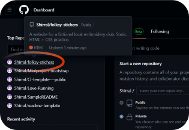

2. I entered the repository and opened its settings.

    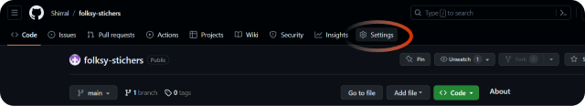

3. There, in the menu on the left of the screen, I located Pages.

    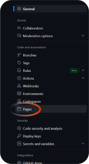

4. Under "Build and development", there is a "Branch" section. I chose the `main` branch from the dropdown menu and clicked on the `Save` button.

    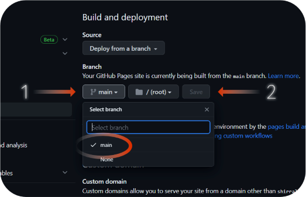

5. That's it! The site is now deployed and can be accessed from the link created by GitHub. The link can be found on the top of the "Pages" page once it refreshes.

    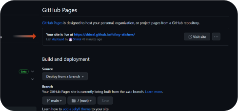

### Forking the project on GitHub

If, for whatever reason, anyone would like to get themselves a copy of this project to tinker with on their own - feel free to do so! Here is how to do it so you can have your own copy of the entire repository that you can do whatever you please with, without causing any changes to the original:

1. Open the repository of this project on GitHub. It can be found [here](https://github.com/Shirral/folksy-stichers).

2. Find he "Fork" button located between the "Watch" and "Star" buttons, near the top of the repository page.

    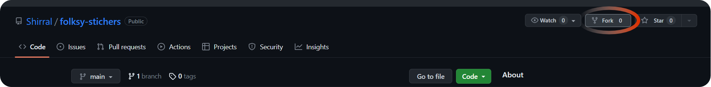

3. Done! Go back to your profile - you will find the copy of the project in your repositories.

## Technologies and Resources used

### Programming languages used:

- **HTML5**
- **CSS3**

### Frameworks & Libraries Used:

- **[Bootstrap 5.3.0](https://getbootstrap.com/docs/5.3/getting-started/introduction/)** - used to build the navigation bar with the collapsible burger icon menu, the modals, and to help with the styling of the website.
- **[Google Fonts](https://fonts.google.com/)** - used to supply two fonts used throughout the website: *Cookie* and *Ysabeau Infant*.
- **[Font Awesome v.6](https://fontawesome.com/)** - used to supply the social media icons in the footer, the down arrow icon in the hero image sections, the email and location icons in the "Contact" page, and the thumbs up icon on the "Thank you" page.
- **[Flickity](https://flickity.metafizzy.co/)** - used to build the carousel gallery in the "Welcome" section of the home page. [GNU license here.](https://www.gnu.org/licenses/gpl-3.0.html)

### Software & other technologies used:

- **[Visual Studio Code](https://code.visualstudio.com/)** - IDE the project was written in. Used with the [Live Server (Five Server)](https://marketplace.visualstudio.com/items?itemName=yandeu.five-server), [HTML Boilerplate](https://marketplace.visualstudio.com/items?itemName=sidthesloth.html5-boilerplate) and [IntelliSense for CSS class names in HTML](https://marketplace.visualstudio.com/items?itemName=Zignd.html-css-class-completion) extensions.
- **[GitHub Desktop](https://desktop.github.com/)** - used for version control and pushing commits to GitHub.
- **[GitPod](https://www.gitpod.io/)** - used solely for contacting Code Institute's Tutor Support.
- **[Affinity Photo](https://store.serif.com/en-gb/update/windows/photo/1/)** - used for image editing & creating the mockup picture.
- **[Canva](https://www.canva.com/)** - used to get the screens mockup base.
- **[Microsoft Photos](https://apps.microsoft.com/store/detail/microsoft-photos/9WZDNCRFJBH4)** - used for quick cropping and resizing of images.
- **[Squoosh](https://squoosh.app/)** - used for compressing images.
- **[Runway](https://app.runwayml.com/dashboard)** - used for expanding and upscaling images.
- **[VEED.IO AI Image Generator](https://www.veed.io/tools/ai-image-generator)** - used to generate three images of the club members for the carousel (`club-meeting.jpg`, `club-meeting-2.jpg`, `man-embroidering.jpg`).
- **[DALL-E 2](https://openai.com/dall-e-2)** - used to edit the images generated with VEED.IO AI Image Generator.
- **[ChatGPT](https://openai.com/blog/chatgpt)** - used to generate text for the "Welcome" section, the meta description of index.html, and the descriptions of the stitches on the "Our Stitches" page. These were then edited to fit the needs of the project better.

### Pre-made code used:

- the CSS code for the zoom-in text animation in the hero image section was taken from the [Love Running code-along training project](https://github.com/Shirral/Love-Running), where it was used for the hero image itself. 

### Images used:

- **[Nasim Keshmiri's photo](https://unsplash.com/photos/kXu175oATys)** @ Unsplash
- **[monika1607's photo](https://pixabay.com/photos/handwork-embroidery-2943250/)** @ Pixabay
- **[makamuki0's photo](https://pixabay.com/photos/curtain-burlap-embroidery-cloth-1202946/)** @ Pixabay
- **[Büşra Şahin's photo](https://www.pexels.com/photo/close-up-of-embroidered-roses-13631020/)** @ Pexels
- **[Frannie D's photo](https://unsplash.com/photos/W7cP6n0NKjc)** @ Unsplash
- **[TinaDemyanchuk's photo](https://pixabay.com/photos/embroidery-decoration-hobby-5308954/)** @ Pixabay
- **[Santoshi Guruju's photo](https://unsplash.com/photos/4BH85qJQi_s)** @ Unsplash
- **[cottonbro studio's photo](https://www.pexels.com/photo/a-man-and-a-woman-meeting-up-in-a-restaurant-6321255/)** @ Pexels
- **[bluemorphos's photo](https://pixabay.com/photos/embroidery-needlework-cross-stitch-942255/)** @ Pixabay
- **[Barbara Krysztofiak's photo](https://unsplash.com/photos/Xe2JI5rwZ8I)** @ Unsplash
- **[Annie Spratt's photo](https://unsplash.com/photos/xTaOPMa6wAE)** @ Unsplash
- **[Ronin's photo](https://unsplash.com/photos/dOIAbk3KtjA)** @ Unsplash
- **[Toa Heftiba's photo](https://unsplash.com/photos/ScuVVivQPTc)** @ Unsplash
- **[Gio Gix's photo](https://unsplash.com/photos/iKO49WSTJaU)** @ Unsplash
- **[Marina Meyer's photo](https://www.pexels.com/photo/handmade-embroidery-with-cat-design-9480590/)** @ Pexels
- **[Davies Designs Studio's photo](https://unsplash.com/photos/RmUPheUyXBU)** @ Unsplash
- **[Bru-nO's photo](https://pixabay.com/photos/embroidery-embroidered-craft-3524900/)** @ Pixabay
- **[Tony Sebastian's photo](https://www.pexels.com/photo/photo-of-an-embroidery-hoop-with-a-christmas-tree-pattern-15118151/)** @ Pexels
- **the images of the club members for the carousel (`club-meeting.jpg`, `club-meeting-2.jpg`, `man-embroidering.jpg`)** have been generated with VEED.IO AI Image Generator.

### Videos used:

- **[How to do Running Stitch](https://youtu.be/fgzb7O7tkzQ)** by 
**Sarah's Hand Embroidery** on YouTube
- **[How to do Back Stitch](https://youtu.be/vLafsVQyEjU)** by 
**Sarah's Hand Embroidery** on YouTube
- **[How to Satin Stitch - Embroidery Tutorial for Beginners](https://youtu.be/qkCq2p7PJOQ)** by 
**Paraffle Embroidery** on YouTube
- **[How to do Cross Stitch (Traditional method)](https://youtu.be/qOZfqyHFn6A)** by 
**Sarah's Hand Embroidery** on YouTube
- **[How to do Lazy Daisy Stitch](https://youtu.be/jYTDjIq36Zg)** by 
**Sarah's Hand Embroidery** on YouTube
- **[How to do Woven Spider Wheel](https://youtu.be/EDbRRM5o5OQ)** by 
**Sarah's Hand Embroidery** on YouTube
- **[How to do Chain Stitch](https://youtu.be/kzwzaom_KP0)** by 
**Sarah's Hand Embroidery** on YouTube
- **[How to do French Knots](https://youtu.be/mVqPzHw1x0w)** by 
**Sarah's Hand Embroidery** on YouTube

### Text used:
- the text in the "Welcome" section, the meta description of index.html, and the descriptions of the stitches on the "Our Stitches" page have been generated with ChatGPT. These were then edited to fit the needs of the project better.
- everything else was written by me.

### How-to references used:

- [Gradient overlay on top of images](https://www.geeksforgeeks.org/css-combine-background-image-with-gradient-overlay/)
- [Fixing the responsiveness of embedded Google Maps](https://blog.hubspot.com/website/how-to-embed-google-map-in-html#:~:text=The%20default%20Google%20Maps%20embed,it%20in%20your%20HTML%20document.)
- [Creating modals with Bootstrap](https://www.jqueryscript.net/demo/confirm-dialog-button-bootstrap/)
- [Setting border colour in focused text fields](https://stackoverflow.com/questions/69901519/cant-change-border-color-when-input-field-is-active)
- [W3 - visiting to consult the HTML/CSS documentation throughout working on the project](https://www.w3schools.com/)

### Project guidance & assistance:

- **My Mentor, Mitko Bachvarov**, and **UCP's Peter Wright** - thank you for your feedback and guidance!
- **CI Tutor Assistance's Oisin** - thank you for the troubleshooting help!

## Live website link: 

https://shirral.github.io/folksy-stichers/index.html