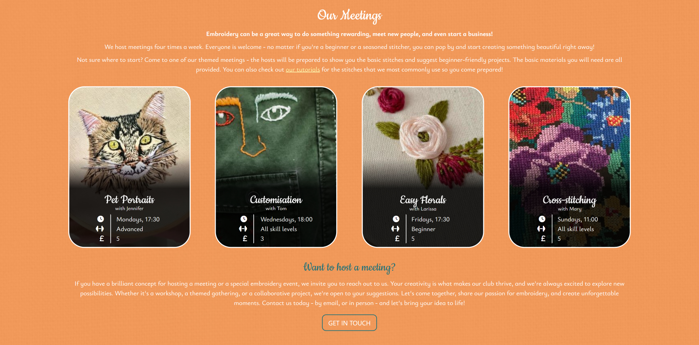
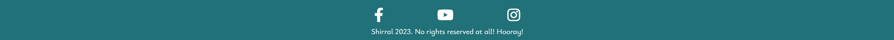

# Folksy Stitchers

**Folksy Stitchers** is a website created for a fictional embroidery club meeting up regularly to practice their craft, learn new techniques, make friends, and have a great time while creating something beautiful together with others in a relaxed, informal atmosphere.

The website caters both to existing members, who might wish to join the club's Facebook group or share their ideas for the upcoming meetings, and to new members, who might want to know what meetings are available, where or when they take place, or who might have questions. It also responds to the needs of the uncertain who might wonder whether they want to give it a try, but have some concerns - such as, "I've never done it before, I don't know where to start", or, "do I need to bring anything?".

## Features

### General

- **responsive design**: the website responds to a wide variety of screen sizes. Individual elements of each page have been given their own media queries featuring breakpoints adjusted as needed for the element to look good on a particular screen instead of picking a few set breakpoints and ignoring the screens in between which might need additional adjustments. 
  

### Navigation bar

The navigation bar was built using Bootstrap and customized with CSS. It allows the user to easily move between the website's three pages: the home page, the "Our Stitches" page with information and tutorial videos on the most common embroidery stitches used during the club meetings, and the "Contact" page where the contact information and the newsletter signup form can be found.

On mobile devices (breakpoint at 767px), the navbar collapses into a burger icon that can be expanded upon tapping.
  

To improve the semantic structure of the navigation bar, the `<menu>` tag has been used instead of the more generic and non-specific `<ul>`.

### Hero image section

The hero image section is present on all the pages, as a strong visual element that lets the user know what the page is about and invites them to continue reading and as a familiar, repeating element of the interface that ties the design of the website together. 

It features an image relevant to each page's topic with a gradient overlay that provides darker background for the text, big text stating the page's topic with a subtle animation, and a gently pulsing Font Awesome down arrow icon that scrolls down, taking the user to the main body of the page, upon clicking.
  

### "Welcome" section

The "Welcome" section introduces the user to Folksy Stitches - what it is, what is the purpose of the club, and what they might expect upon joining. 

It features a heading, a short paragraph of text that conveys the main goals of the club and its atmosphere and a Flickity carousel gallery showcasing the photographs of the club meetings: the club members at work and the embroidery created during the meetings.
  

### "Our Meetings" section

"Our Meetings" section aims to provide the basic information about the club meetings: what meetings are avaiable, how often they happen and on what days, what is the time of the meetings, their cost, and what skill levels they cater to.

A heading and three short paragraphs of text are followed by a grid showcasing the information about four kinds meetings. Each grid item contains a picture representing the meeting's theme, its name, the name of the person hosting the meeting, and the information about the date, time, skill level and cost. There is a black semi-transparent overlay on top of the images to provide good contrast between the picture and the the white text on top of it, making it easy to read.

Below the grid, there is a **Want to host a meeting?** subsection. The text invites the user to share their ideas for a meeting they might like to host; below, a link styled as a button invites them to click on it, leading them to the Contact page where the club's contact information can be found. The link-button changes its colours upon hovering over it with a mouse.
  

### "Stitches we use" section

This section is aimed at embroidery beginners. It's a resource allowing the user to get familiar with the most common stitches routinely used at the club meetings, learn what a given stitch can be used for, and how to sew it.

The section as it appears before the user when they visit the Our Stitches page contains a heading, two short paragraphs of text and a grid of eight interactive elements. Each element contains the name of the stitch it presents, a dark gradient below it to make the text visible and keep the visual style of the information boxes consistent across the pages, and picture presenting the stitch used in embroidery below the text and the gradient.
  

Upon clicking on the chosen box, a modal appears at the centre of the screen. Here the user can learn about the stitch of their choice and watch an instructional video on how to do it.

The videos are all embedded YouTube videos and the modals were created using Bootstrap's modal component. The user can leave the modal either by clicking on the "Close" button, or by clicking away from the modal - on the darkened background around it.
  

### Newsletter signup section

The first section on the Contact page gives the user the opportunity to stay up to date with the club's activities - either by joining the club's Facebook group where an inline link in the first paragraph leads, or by signing up to the club's newsetter.

The second paragraph of text invites the user to sign up, explains the benefits of doing so, and tells the user how often the newsletter would be sent. It is followed by a **signup form**.

**The newsletter signup form** asks the user to provide their name and email address (a text field and an email field), asks about their embroidery proficiency level (radio inputs), and about their main reasons for doing embroidery (multiple choice question - checkbox inputs). The answers to the two questions mentioned would be used by the club to curate the right kind of content for every newsletter recipient - for example, they would send complicated project ideas only to the most experienced members, while the members who run their own embroidery businesses could receive tips on marketing their creations to a wider audience.
  

At the very end of the form is a "Sign up!" button. The button changes its colours upon hovering over it with a mouse. After clicking it, the user is redirected to a *Thank you* page which confirms their signup was successful. From there, they can click on the "BACK TO THE SITE" button, taking them back to the Contact page, or use the navigation bar to go to the page of their choosing.

shown a confirmation message by the browser (form attribute: `onSubmit="alert();"`). When they click "OK", the page refreshes.
  

### "Contact us" section

This section exists to provide the user with a means of contacting the club. It consists of a heading, a paragraph of text, and the club's email address with a Font Awesome icon and a link, allowing the user to click on the address to open their email client, if they have one, and start writing their message that will be sent to the club's email address.
  

### "Where to find us" section

This section provides the user with the physical address of the place where the club meetings take place. As with the email address in the previous section, the address is separated from the paragraph of text by margins, higher font weight, and the inclusion of a Font Awesome icon.

The section also contains an embedded Google Maps map centered on the location of the club activities with a pin highlighting the right place and the address visible in the upper left corner.
  

### Footer

The simple footer adheres to the website's colour scheme and features three external links to the club's social media pages - Facebook, YouTube, and Instagram - in form of Font Awesome social media icons. There is also a short paragraph of text below the links.

The footer is present at the very bottom of each page of the website.
  

### Future features

- **additional page with downloadable embroidery patterns:** free patterns divided by the techniques used and their difficulty level would make a great asset for the club members.

- **additional page with stories from members:** Folksy Stitchers is meant to be a social club - it would be good if the website could reflect that more. Personal stories from the members about their club adventures, the friendships the club helped them make, and the other benefits they draw from being a part of the organisation, would be great - they could be important for the potential new members trying to figure out whether they want to try it or not.

- **rounded corners on the carousel gallery:** it would be great to match the carousel to fit visually with the other rectangular elements of the website, which have all been given rounded corners. Sadly, I was not able to achieve that in case of the Flickity carousel. Future releases would benefit from its own custom-made carousel which would be easier to customize; it would also lower the site's dependency on external assets.

- **more fluid hover animations:** buttons and links that change their state on hover would look better if the change of state was more gradual. It would be good to add simple CSS animations to achieve that.

- **better optimization:** although the website looks good and works well on all screen sizes, it could be optimized better to use up less data and load faster, especially on mobile devices. Differently sized image files could be provided for different devices and next-gen image formats could be used. Bootstrap could be removed and its components used in the project could be replaced with custom-made ones to avoid the user's browser having to load a big external asset.

- **better accessibility:** using Font Awesome means some elements of the current design might not be clear to screen reader users, as they cannot have `aria-label` attribute added to them. Future releases would benefit from their own icons presented as image files. 

## User Experience & User Interface (UX/UI)

### Site goals

The main goal of the **Folky Stitchers** website is to provide its users - club members and potential future club members - basic information about the club and the meetings it hosts. It also aims to encourage embroidery beginners who might be worried about their lack of experience by providing reassuring words and the information about the basic stitches they will need to start, along with simple to follow tutorials.

The website also invites the users to follow the club's activities more actively by encouraging them to join their Facebook group, sign up to their newsletter, and visit their social media profiles. Finally, it gives the users a way of contacting the club.

The users should be able to find their way around the website easily while the design should be pleasing to the eye and work on a wide variety of devices without causing unpleasant visual glitches or functional errors. 

### User stories

#### First time visitors - ie. curious about the club:

- As a First Time Visitor, I want to learn what the club is about.
- As a First Time Visitor, I want to learn what kind of activities the club offers.
- As a First Time Visitor, I want to learn if I can join without any prior embroidery experience.
- As a First Time Visitor, I want to learn what is the character of the club - is it for people serious about learning and perfecting the craft? Or more laid back with a bigger focus on the social aspect?
- As a First Time Visitor, I want to find the club's social media pages to look up what kind of things they post there.

#### Returning visitors - ie. considering joining the club:

- As a Returning Visitor, I want to ask someone questions about the club.
- As a Returning Visitor, I want to learn how much do the meetings cost.
- As a Returning Visitor, I want to learn if I'd need to bring anything to a meeting if I was to come.
- As a Returning Visitor, I want to learn if I can prepare a little bit before coming to my first meeting - I don't want the host to have to focus on teaching me the most basic things while the rest of the group waits.
- As a Returning Visitor, I want to learn where do the meetings take place.

#### Frequent visitors - ie. existing club members:

- As a Frequent Visitor, I want to find a way to keep in touch with the other members of the club.
- As a Frequent Visitor, I want a to be updated with the latest news and information about the club's activities.
- As a Frequent Visitor, I want to find the club's email address so I can suggest my ideas to the organisers.

### Design

#### Colour scheme

The Folksy Stitchers website features 

-------------

style:

- colours
- fonts
- gradient dark transp
- rounded corners
- canvas bg